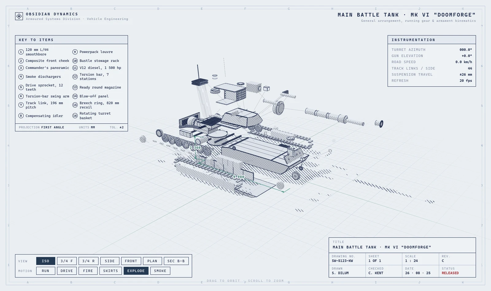
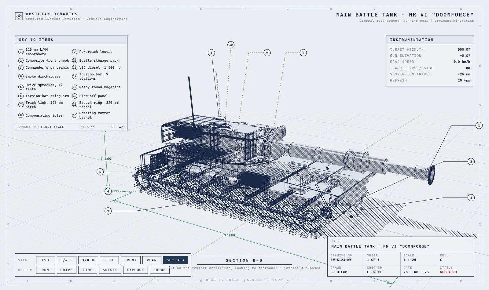
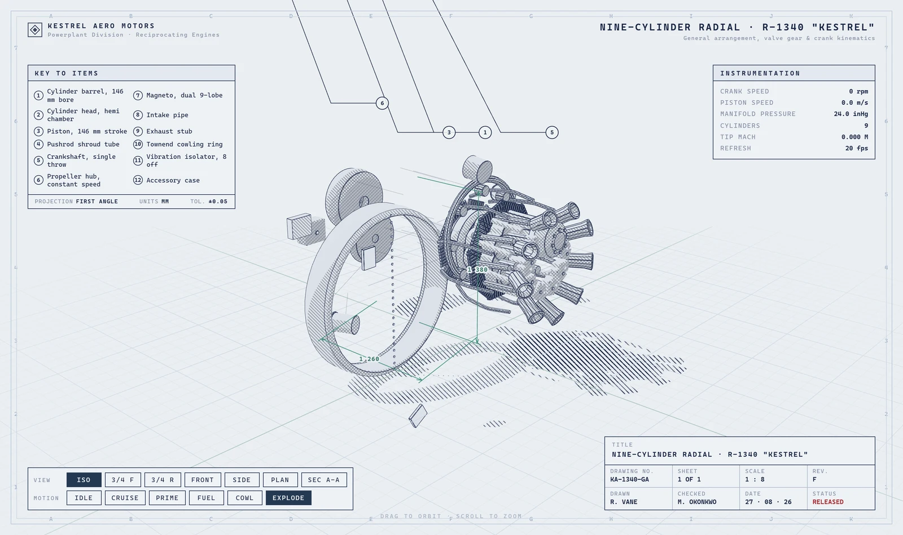

**English** | [简体中文](README.zh-CN.md)

# blueprint-3d-sheet

Turn a 2D drawing, CAD file, photo, or written brief into **one self-contained
interactive 3D engineering sheet** — orthographic plates, numbered callouts on
leader lines, dimensions, a section cutaway, a full exploded view, live
instrument readouts and animated motions, in a single offline `index.html`.

[**Live demo →**](https://lubocsu.github.io/blueprint-3d-sheet/)



```
drawing / brief ──▶ AssemblySpec (JSON) ──build──▶ Three.js scene ──▶ one index.html
                        the contract            deterministic       self-contained
                   validated · hand-editable · reproducible
```

The spec in the middle is the whole design: the author emits *data, never code*,
so a sheet can be schema-checked, measured against a density bar, hand-corrected
and rebuilt deterministically. Any 3D object — machine, building, appliance,
vessel, instrument — goes through the same path.

| | |
|---|---|
|  |  |

## Install as a Claude Code plugin

```bash
/plugin marketplace add lubocsu/blueprint-3d-sheet
```

then

```bash
/plugin install blueprint-3d-sheet@blueprint-3d-sheet
```

Claude then has a `blueprint-3d-sheet` skill that judges whether your material is
detailed enough, authors the spec, gates it, builds it and verifies the result.
See [`skills/blueprint-3d-sheet/SKILL.md`](skills/blueprint-3d-sheet/SKILL.md).

## Or use it standalone

```bash
git clone https://github.com/lubocsu/blueprint-3d-sheet
cd blueprint-3d-sheet && npm install
node bin/b2d.mjs build examples/mbt-mk6/spec.json --out out/mbt-mk6
```

Open `out/mbt-mk6/index.html`. No server, no network, no external assets.

`npm install` pulls a Chromium (~300 MB) through puppeteer, which is what renders
the verification screenshots. To skip it:

```bash
PUPPETEER_SKIP_DOWNLOAD=1 npm install
```

Authoring, `validate` and `build` work without it; only `selftest` and the two
`dev/` checks need a browser. Add one later with
`npx puppeteer browsers install chrome`. Do **not** use `npm install --omit=optional`
— it also strips esbuild's own platform binary and the install fails.

## What touches the network

The emitted page never does: no requests, no fonts, no analytics, no telemetry.
CI asserts this on every push, and the deploy refuses to publish a page that
carries an external URL.

In the toolchain, exactly one thing reaches the network in normal use:
`npm install`, which may download Chromium (above). Authoring, `validate`,
`build` and `selftest` are otherwise fully offline and need no credentials.

See [Not in this release](#not-in-this-release) for unfinished code that ships in
this repository and *can* make requests when invoked deliberately.

## Commands

```bash
b2d validate <spec.json> [--strict]                  # schema + semantics + density gate
b2d build <spec.json>    [--out dir] [--no-minify] [--embed-font f.woff2] [--force]
b2d selftest <spec.json> [--out dir] [--shots dir]   # render every view/motion headless + sheet checks
b2d serve                [--port 5178]               # static server for the dev harness
```

`ingest`, `research` and `bundle` also exist in the CLI. They are unfinished and
deliberately left undocumented here — see [Not in this release](#not-in-this-release).

`--strict` promotes the softer shortfalls (too few orthographic views, too
little of the sheet animating, untraceable figures) from warnings to errors.
`--force` builds a spec that failed the gate anyway, which is what you want
while iterating on one by hand.

## Why a spec in the middle

The model emits **data, not code**. That single decision is what makes the rest
work: the spec can be schema-validated, measured against a density bar, hand-
corrected, diffed, and replayed. The renderer never has to trust generated
JavaScript, and it can be developed offline against a committed spec.

## The four things that make it general

Everything subject-specific in the reference (`FIRE`, `SKIRTS`, turret azimuth)
is data. Outside comments and the archetype vocabulary table — which is a domain
dictionary by design — the word "turret" appears nowhere in `src/`: no builder,
renderer or runtime branches on it.

**1. Drivers and channels.** A spec declares named scalars (`speed`, `rpm`,
`openness`). Parts bind animation channels to expressions over them. Console
buttons push driver targets; instrument rows print driver expressions. A tank's
`DRIVE`, a turbine's `SPIN` and a door's `OPEN` are the same ten primitives:

`spin · oscillate · reciprocate · articulate · pathFollow · impulse · visibility · explode · emit · flow`

**2. Drafting section-lining as the material system.** ISO 128 / ANSI Y14.2
already standardise how substances read on a drawing, so `metal` is 45°
crosshatch, `casting` is stipple, `glass` is sparse broken diagonals, `masonry`
is coursed brick, and so on across twelve materials. By default these are used
on **section cut faces only** — solid surfaces all take the single crosshatch
the reference uses. See *Rendering* below.

**3. Detail decorators.** Most of the density in a real drawing is fasteners,
louvres, grilles and tread plate. Twelve procedural generators (`boltCircle`,
`louvre`, `rivetRow`, `perforation`, …) turn one spec line into hundreds of
correct-looking features.

**4. Archetypes + a density gate.** `src/ingest/archetypes.mjs` tells the model
how each class of subject is actually decomposed — eight of them (`vehicle`,
`rotating-machine`, `mechanism`, `structure`, `appliance`, `vessel`, `aircraft`,
`instrument`) plus a `generic` fallback. `src/spec/richness.mjs` then *enforces*
the result: part count scaled to the archetype, a note on every part, minimum
callouts, dimensions, views, motions, instruments and details. A thin spec is
rejected with a list of what is missing, which is fed straight back for repair.
This is the mechanism that stops an arbitrary subject producing eight boring
boxes.

## Knowing what the drawing does not know

The density gate can force a note onto every part. It cannot tell whether the
note is **true**, and a sheet of confident invented figures is worse than a
sparse honest one. Three stages close that gap, none of which can fail a build.

**Evidence scoring** (`src/ingest/evidence.mjs`) replaces "is the brief long
enough" with seven axes — `identity · scale · decomposition · internals ·
kinematics · materials · geometry` — each scored 0..1 and weighted by what the
subject's archetype actually demands. A vessel described with nothing about its
interior is badly under-evidenced; a bracket in the same state is fine. The
output is not a verdict but a **gap list**, which is what makes the follow-up
targeted rather than a blanket re-ask. Deterministic, offline and cheap: no
model is consulted to decide whether to consult a model.

Closing a gap is a human step, not an automated one: read the supplied material
again, ask the person who has the answer, or record the figure as unknown. What
the gap list buys you is a specific question instead of a blanket re-request.

The gate escalates *once*. When the returned spec is thin on something that
reads as missing **knowledge** rather than a malformed spec — a section view
with nothing inside it — the gate names the gap instead of asking the model
to try harder, which would only invite it to invent more. Too few callouts does
not escalate; that is laziness, not ignorance.

**Grounding** (`src/spec/grounding.mjs`) then counts. Every figure the sheet
asserts is extracted, canonicalised through unit families (so `7.7 m` matches a
dossier's `7700 mm`), and matched against the numbers actually present in the
dossier, the brief and the text on the CAD drawing. The ratio lands in
`meta.grounding`, and below 25 % the gate says so. It measures whether a figure
is **traceable**, not whether it is correct and not whether it is attached to
the right part — the reported wording says "traceable" for exactly that reason.
What it catches is the failure that is otherwise invisible: a sheet full of
confident figures that came from nowhere at all.

Provenance ends up on the spec itself: `meta.researched`, `meta.references`,
`meta.grounding`. An *absent* flag means hand-authored and is left alone; only
an explicit `false` means ingest ran and nothing was checked.

## The annotation layer

Annotation is a **3D** problem here, and it is *solved*, not tracked:

- **Deferred regeneration.** Any operation that changes the picture — view
  switch, motion toggle, orbit, zoom, resize — fades the layer out and freezes
  it. Once the picture has been quiet for ~400 ms the whole layout is re-solved
  once and fades back in. Nothing sweeps across the drawing while you are moving
  it. `dev/smoothness.mjs` reports **0.0 px** of annotation travel — median, p99
  and max alike, over 2400 samples — during a spin.
- **The exit point is on the component, and it slides.** Each part's surface is
  sampled into candidate points with normals at build time; each solve picks the
  one that faces the camera and sits on the side the balloon will occupy. Rotate
  the model and the leader walks around the part. `dev/anchor-check.mjs`
  measures it: 12/12 anchors relocate on `radial-engine`, 10/16 on `mbt-mk6` —
  the rest sit on parts whose visible face barely changes across the probe's
  viewpoint swing, where holding still is the correct answer.
- **Leaders ignore moving parts.** Anchors resolve in the part's frame *above*
  the animation channels, so a spinning road wheel or a stroking piston never
  drags its leader — measured at **0.00 px** while DRIVE and CRUISE run. Explode
  is the deliberate exception: a separated part takes its leader with it, or you
  cannot tell which piece is which.
- **Never over the drawing.** Gutters sit outside the projected silhouette, and
  gutter runs subtract the bands the panels occupy.
- **Ordered, not rigid.** Members are ordered by anchor position (which also
  makes crossing leaders impossible), grouped into clusters by subsystem with a
  gap between clusters, and stepped into three lanes by how deep the anchored
  feature sits. Balloons sharing a lane align exactly; the gutter as a whole is
  a staircase, not a dead-straight column.
- **Leaders are two-segment**: a horizontal shoulder off the balloon, then a
  straight run to a dot on the anchor — the construction the reference uses.

`callout.point` is a **hint** about where on the part to attach, not a hard
coordinate — the solver stays in its neighbourhood but still slides.
`callout.instance` picks which repeat of an instanced part to attach to.

## Views

Orthographic views become **drawing plates**: the legend and instrumentation
panels step aside, dash-dot datum centrelines appear, the cast shadow and
perspective grid drop out, and the model is zoomed to fit its own projected
silhouette rather than a fixed distance.

Dimensions are **world-space geometry** in teal, not a flat overlay — they lean
with the perspective and their arrowheads foreshorten. Only the label stays in
screen space, and it stays horizontal however steeply the line runs. Each
dimension appears only in the views where it reads: length on side/plan, height
on side/front, width on front/plan, derived automatically from the axis it
measures.

## Rendering

Screen-space hatching, not textures: pitch is computed from
`gl_FragCoord / devicePixelRatio`, so it stays constant across curvature, depth
and display density — matching the reference exactly. Tone is quantised into
four density tiers the way a draughtsman picks a hatch.

**One crosshatch, not twelve.** The reference uses a single 45° crosshatch for
every substance and varies only its density, so that is the default. The
per-material patterns are kept for **section cut faces**, which is the job
drafting standards actually give them — a section then distinguishes steel from
concrete from glass. Set `style.materialHatch: "per-material"` to pattern every
surface instead.

The ground shadow is a **true planar projection** of the real geometry along the
light direction, not a footprint approximation: it shows concavities and follows
everything the model does — the hull rocking, the turret slewing, the tracks
marching, parts flying apart on EXPLODE. `style.shadow` can drop it back to a
cheap static hull for very large assemblies.

Outlines are `EdgesGeometry` + `LineSegments2` for constant screen-space width,
not a post-process pass. Section views clip with a plane and force cut faces to
dense section lining. "Orthographic" views are reached by tweening the FOV down
to ~2° while dollying back, which converges on a parallel projection without the
pop of swapping cameras.

**Exploded views carry their traces.** On a printed exploded assembly every part
is joined to the hole it came out of by a thin broken line; without them the
view is a cloud of components rather than a disassembly instruction. One
`LineSegments2` for the whole assembly, two vertices per part instance, rewritten
in place each frame in world space (`src/render/explode-trace.mjs`).
`dev/explode-check.mjs` asserts what an exploded view is easy to fake — that it
comes *apart* rather than merely inflating: on `mbt-mk6`, mean pairwise
separation ×2.31, mean burial 48 % → 5.5 %, enclosure 20 % → 0 %, and all 16
internal parts hidden on ISO and revealed on EXPLODE.

## Layout

```
bin/b2d.mjs           CLI
src/spec/             schema.json, validate, richness gate, grounding, normalize,
                      expression language, explode participation
src/build/            geometry (15 shape types), csg, detail decorators, assembly, edges
src/render/           hatch shader, material table, scene, chrome, annotations, dimensions,
                      explode traces, app entry
src/runtime/          drivers, the ten channels, views, interaction
src/ingest/           archetypes, evidence scoring, research, prompt, credentials,
                      model client + repair loop, raster/vector readers
src/emit/             esbuild bundle -> single inlined HTML
templates/            page shell + stylesheet
examples/             mbt-mk6 (reference parity), radial-engine (generality), smoke (engine test)
dev/                  hatch-lab shader harness, headless screenshot, smoothness + anchor +
                      explode probes, offline evidence + research checks, static server
```

Every probe asserts and exits non-zero on a violation, so each one actually
guards the claim made above rather than reporting a number nobody reads:

```bash
node dev/smoothness.mjs   out/mbt-mk6/index.html               # annotation travel during a spin
node dev/anchor-check.mjs out/mbt-mk6/index.html --motion drive
node dev/explode-check.mjs out/mbt-mk6/index.html              # comes apart; internals revealed
node dev/evidence-check.mjs    # sufficiency, research request, grounding, escalate-once
node dev/research-check.mjs    # triggers, cache, dossier rendering, degrade paths
```

The last two deliberately do **not** cover a live search: that needs
credentials, and asserting it works without running it would be the exact kind
of unchecked claim the feature exists to prevent.

## Developing

The repository is the single source of truth. Register it as a local
marketplace and the installed plugin reads the working tree, so an edit is live
in the next session without a push:

```powershell
claude plugin marketplace add C:\path\to\blueprint-3d-sheet
claude plugin install blueprint-3d-sheet@blueprint-3d-sheet
```

If you fork this and want the demo site, set **Settings > Pages > Source** to
**GitHub Actions** once. The workflow asks the action to enable Pages itself,
but that needs a token carrying Pages-write permission, which the default
`GITHUB_TOKEN` does not have.

The loop, in PowerShell (`&&` needs PowerShell 7; on 5.1 use `;`):

```powershell
node scripts/check-manifests.mjs; if ($?) { node scripts/check-readmes.mjs }
node bin/b2d.mjs validate examples/mbt-mk6/spec.json --strict
git add -A; git commit -m "..."; git push
```

or in bash:

```bash
node scripts/check-manifests.mjs && node scripts/check-readmes.mjs
node bin/b2d.mjs validate examples/mbt-mk6/spec.json --strict
git add -A && git commit -m "..." && git push
```

A local marketplace serves the *working tree*, including changes you have not
committed. Before a release, verify a clean clone so "it works here" is not
resting on an unstaged file.

`git push` to `main` deploys the demo site, so a broken `main` is a broken
demo. Work on a branch if you are changing the renderer.

## Examples

| | parts (with instances) | proves |
|---|---|---|
| `mbt-mk6` | 51 → 244 | reference parity: 16 callouts, 39 details, 7 views, notes on every part |
| `radial-engine` | 23 → 117 | generality: reciprocating pistons phased 40° apart, section view, six materials |
| `smoke` | 14 → 24 | every channel type in one place; deliberately below the density gate |

`radial-engine` is the real acceptance test — a subject as far from a vehicle as
the vocabulary allows, rendering through the identical engine. `smoke` is
expected to *fail* `validate`; that failure is the gate's own test.

## Extending

- **New subject** → write a spec. No code changes.
- **New domain knowledge** → add an entry to `src/ingest/archetypes.mjs`: its
  guidance prose, its per-axis `demand` weights, and the part / internal /
  motion vocabulary that evidence scoring counts the input against.
- **New shape** → add a builder to `src/build/geometry.mjs` and a branch to the
  schema's shape union.
- **New material** → add a pattern branch to `src/render/hatch-material.mjs` and
  an entry to `MATERIAL_INDEX`.

## Prerequisites

Node 20+. ffmpeg on PATH is used to downscale drawings, and `@resvg/resvg-js` is
optional: with it an SVG is also rasterised; without it the vector path is
text-only, which still works.

`validate`, `build` and `selftest` need no credentials of any kind.

## Not in this release

**Gathering evidence from the web is unfinished and is not a feature of this
version.** The repository does ship the code — `src/ingest/bundle.mjs` can
download URLs you supply, and `src/ingest/research.mjs` can call a search-backed
model — so it is disclosed here rather than hidden. But:

- `bundle` has only ever been exercised against a local test server
  (`dev/gather-check.mjs`, 24 assertions). It has never been run against a real
  source.
- `research` has never been run at all; there were no credentials on the
  development machine.

Neither is documented as a workflow, neither is reachable from the skill, and
neither should be relied on. Treat both as work in progress.

## Licence

MIT — see [LICENSE](LICENSE).

Dependencies are all permissively licensed: three, esbuild, ajv, ajv-formats,
dxf-parser, three-bvh-csg and the Anthropic SDK are MIT; puppeteer is Apache-2.0.
